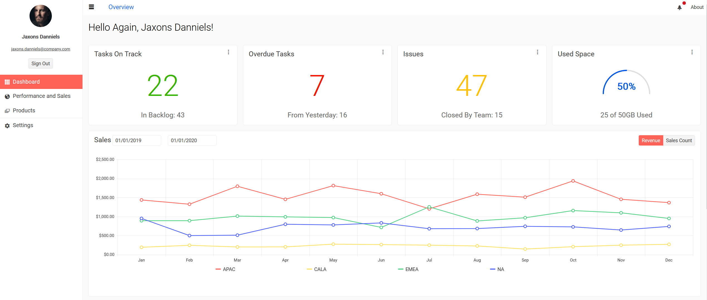
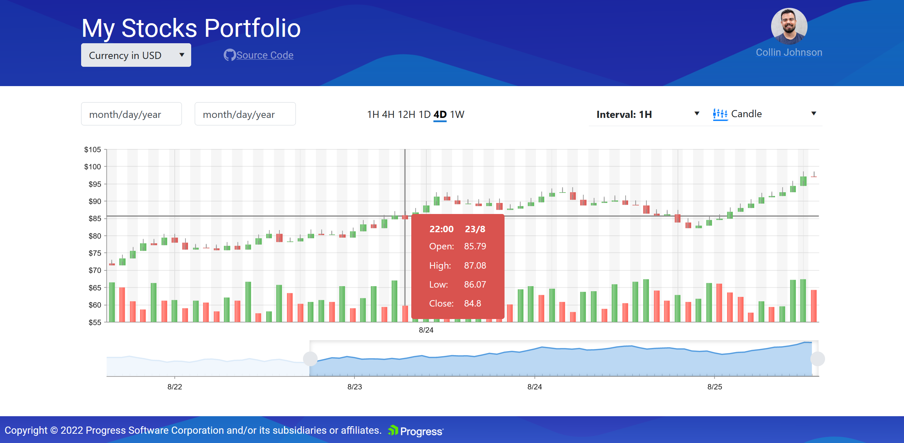
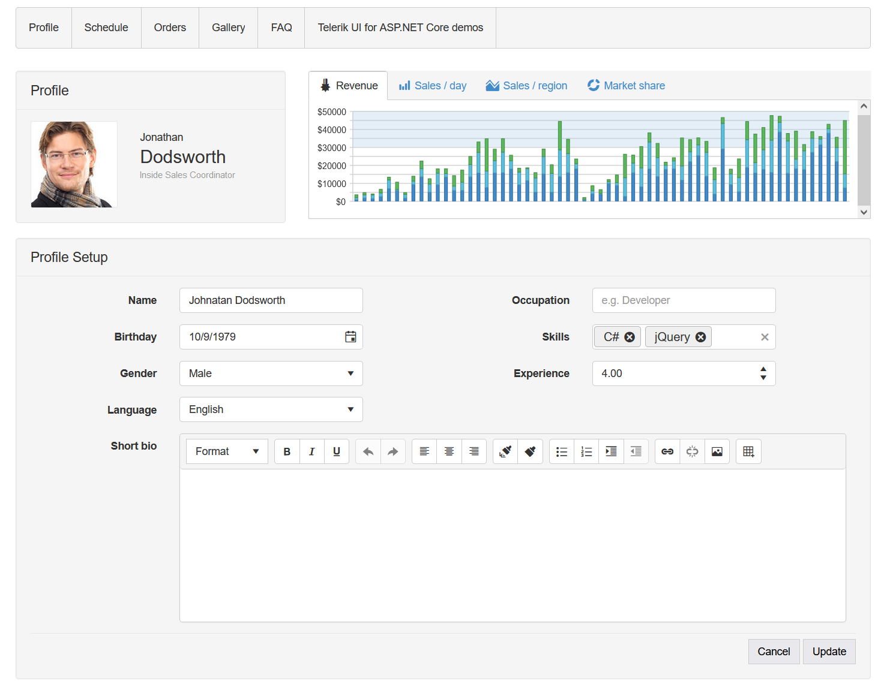

# Telerik UI for ASP.NET Core Components

Telerik UI for ASP.NET is library of 110+ full-featured ASP.NET UI components that enable you to build everything from complex data-driven applications to user facing web apps, with tons of customization options covering every UI development need: navigation and layout, data management and visualization, editing, interactivity and more.

This repository contains examples related to the [Telerik UI for ASP.NET Core components](https://www.telerik.com/aspnet-core-ui?utm_medium=referral&utm_source=github&utm_campaign=core-trial-components-examples-github) that can be used in addition to the technical documentation and demos. These examples demonstrate common scenarios and provide answers to frequent how-to-questions regarding the most popular and widely used Telerik UI for ASP.NET Core components:

- [ASP.NET Core Data Grid](https://www.telerik.com/aspnet-core-ui/grid?utm_medium=referral&utm_source=github&utm_campaign=core-trial-components-examples-github)
- [ASP.NET Core Chart](https://www.telerik.com/aspnet-core-ui/charts?utm_medium=referral&utm_source=github&utm_campaign=core-trial-components-examples-github)
- [ASP.NET Core Editor](https://www.telerik.com/aspnet-core-ui/editor?utm_medium=referral&utm_source=github&utm_campaign=core-trial-components-examples-github)
- [ASP.NET Core Scheduler](https://www.telerik.com/aspnet-core-ui/scheduler?utm_medium=referral&utm_source=github&utm_campaign=core-trial-components-examples-github)
- [ASP.NET Core PDF Viewer](https://www.telerik.com/aspnet-core-ui/pdf-viewer?utm_medium=referral&utm_source=github&utm_campaign=core-trial-components-examples-github)
- [ASP.NET Core TreeView](https://www.telerik.com/aspnet-core-ui/treeview?utm_medium=referral&utm_source=github&utm_campaign=core-trial-components-examples-github)

The sample UI for ASP.NET Core projects are provided to demonstrate different frequently asked questions, features and scenarios. They are not part of our testing procedures and should be regarded as a knowledge base. Projects are tested only upon creation as well as when updating or upgrading the project. A prerequisite to run the sample applications is to have installed ASP.NET Core 3.0. 

This repo allows you to experiment with RazorPages and MVC (Model View Controller) samples. To run the projects from this repository, please follow these steps:

1. Clone the repo

## Telerik.Examples.Mvc

1. Open the Telerik.Examples.Mvc.sln file in VS 2019 or VS 2022. 
2. Clean the solution
3. Build the solution and run the MVC project.
4. Navigate to a certain example by adding the ControllerName/ActionMethod to the URL, i.e https://localhost:44361/ajaxbinding/ajaxbinding

> The project uses a local database which is created upon building the project based on the existent migrations.

## Telerik.Examples.RazorPages

1. Open the Telerik.Examples.RazorPages.sln file in VS 2019 or VS 2022. 
2. Clean the solution
3. Build the solution and run the Razor project.
4. Navigate to a certain ASPNET Core example by adding the PageFolder/ViewName to the URL, i.e https://localhost:44361/grid/gridcustomdatasource

**NOTE**: This repository does not contain the actual source code of the components, or the demos application available at the official UI for ASP.NET Core demos. The demos application is available as an offline project from your Telerik UI for ASP.NET Core installation.
***

## Table of Contents

* [Common Support Questions](#common-support-questions)
  * [Where can I find help?](#where-can-i-find-help)
  * [When do you plan to release feature X?](#when-do-you-plan-to-release-feature-x)
  * [Where do I make suggestions?](#where-do-i-make-suggestions)
* [ASP.NET Core UI Components](#aspnet-core-ui-components)
* [Design to development](#design-to-development-support)
* [Sample Applications](#sample-applications)
* [Package References](#package-references)
* [Contribution](#contribution)
* [Licensing](#licensing)
* [Useful Links](#useful-links)
***

## Common Support Questions

### Where can I find help?

1. For community support, we recommend asking questions on the [Telerik UI for ASP.NET Core forum](https://www.telerik.com/forums/aspnet-core-ui?utm_medium=referral&utm_source=github&utm_campaign=core-trial-components-examples-github).
2. If you have an active trial or license, you can use the official [support channel](https://www.telerik.com/account/support-tickets?utm_medium=referral&utm_source=github&utm_campaign=core-trial-components-examples-github) for questions, technical assistance, bug reports or problem resolutions. 

  
### When do you plan to release feature X
Check the [Telerik UI for ASP.NET Core Roadmap](https://www.telerik.com/support/whats-new/aspnet-core-ui/roadmap?utm_medium=referral&utm_source=github&utm_campaign=core-trial-components-examples-github) to see a list of components, features and tooling we have planned. You can also stay up-to-date with recently released features and bits by checking our [What's New](https://www.telerik.com/support/whats-new/aspnet-core-ui?utm_medium=referral&utm_source=github&utm_campaign=core-trial-components-examples-github)  

### Where do I make suggestions?

If your feature isn’t listed in the product roadmap, check our dedicated [feedback portal](https://feedback.telerik.com/aspnet-core-ui?utm_medium=referral&utm_source=github&utm_campaign=core-trial-components-examples-github). You can upvote existing requested items or If you don’t see your feature on our portal, you can request the feature there.

## ASP.NET Core UI Components

### ASP.NET Core Data Management
<table><tbody>
<tr>
  <td><b>ASP.NET Core DataGrid Component</b></td>
  <td><a href="https://www.telerik.com/aspnet-core-ui/grid?utm_medium=referral&utm_source=github&utm_campaign=core-trial-components-examples-github">Gird Features</a></td>
  <td><a href="https://docs.telerik.com/aspnet-core/html-helpers/data-management/grid/overview?utm_medium=referral&utm_source=github&utm_campaign=core-trial-components-examples-github">Grid Documentation</td>
  <td><a href="https://demos.telerik.com/aspnet-core/grid?utm_medium=referral&utm_source=github&utm_campaign=core-trial-components-examples-github">Grid Demos</td>
</tr>
 <tr>
  <td><b>ASP.NET Core ListView Component</b></td>
  <td><a href="https://www.telerik.com/aspnet-core-ui/listview?utm_medium=referral&utm_source=github&utm_campaign=core-trial-components-examples-github">List View Features</a></td>
  <td><a href="https://docs.telerik.com/aspnet-core/html-helpers/data-management/listview/overview?utm_medium=referral&utm_source=github&utm_campaign=core-trial-components-examples-github">ListView Documentation</td>
  <td><a href="https://demos.telerik.com/aspnet-core/listview?utm_medium=referral&utm_source=github&utm_campaign=core-trial-components-examples-github">ListView Demos</td>
</tr> 
 <tr>
  <td><b>ASP.NET Core TreeList Component</b></td>
  <td><a href="https://www.telerik.com/aspnet-core-ui/treelist?utm_medium=referral&utm_source=github&utm_campaign=core-trial-components-examples-github">Tree List Features</a></td>
  <td><a href="https://docs.telerik.com/aspnet-core/html-helpers/data-management/treelist/overview?utm_medium=referral&utm_source=github&utm_campaign=core-trial-components-examples-github">TreeList Documentation</td>
  <td><a href="https://demos.telerik.com/aspnet-core/treelist?utm_medium=referral&utm_source=github&utm_campaign=core-trial-components-examples-github">TreeList Demos</td>
</tr> 
 <tr>
  <td><b>ASP.NET Core Filter Component</b></td>
  <td><a href="https://www.telerik.com/aspnet-core-ui/filter?utm_medium=referral&utm_source=github&utm_campaign=core-trial-components-examples-github">Filter Features</a></td>
  <td><a href="https://docs.telerik.com/aspnet-core/html-helpers/data-management/filter/overview?utm_medium=referral&utm_source=github&utm_campaign=core-trial-components-examples-github">Filter Documentation</td>
  <td><a href="https://demos.telerik.com/aspnet-core/filter?utm_medium=referral&utm_source=github&utm_campaign=core-trial-components-examples-github">Filter Demos</td>
</tr> 
  <tr>
  <td><b>ASP.NET Core PivotGrid Component</b></td>
  <td><a href="https://www.telerik.com/aspnet-core-ui/pivotgrid?utm_medium=referral&utm_source=github&utm_campaign=core-trial-components-examples-github">PivotGrid Features</a></td>
  <td><a href="https://docs.telerik.com/aspnet-core/html-helpers/data-management/pivotgrid/overview?utm_medium=referral&utm_source=github&utm_campaign=core-trial-components-examples-github">PivotGrid Documentation</td>
  <td><a href="https://demos.telerik.com/aspnet-core/pivotgrid?utm_medium=referral&utm_source=github&utm_campaign=core-trial-components-examples-github">PivotGrid Demos</td>
</tr> 
  <tr>
  <td><b>ASP.NET Core PivotGrid v.2 Component</b></td>
  <td><a href="https://www.telerik.com/aspnet-core-ui/pivotgrid-v.2?utm_medium=referral&utm_source=github&utm_campaign=core-trial-components-examples-github">PivotGrid v.2 Features</a></td>
  <td><a href="https://docs.telerik.com/aspnet-core/html-helpers/data-management/pivotgridv2/overview?utm_medium=referral&utm_source=github&utm_campaign=core-trial-components-examples-github">PivotGrid v.2 Documentation</td>
  <td><a href="https://demos.telerik.com/aspnet-core/pivotgridv2?utm_medium=referral&utm_source=github&utm_campaign=core-trial-components-examples-github">PivotGrid v.2 Demos</td>
</tr> 
<tr>
  <td><b>ASP.NET Core Pager Component</b></td>
  <td><a href="https://www.telerik.com/aspnet-core-ui/pager?utm_medium=referral&utm_source=github&utm_campaign=core-trial-components-examples-github">Pager Features</a></td>
  <td><a href="https://docs.telerik.com/aspnet-core/html-helpers/data-management/pager/overview?utm_medium=referral&utm_source=github&utm_campaign=core-trial-components-examples-github">Pager Documentation</td>
  <td><a href="https://demos.telerik.com/aspnet-core/pager?utm_medium=referral&utm_source=github&utm_campaign=core-trial-components-examples-github">Pager Demos</td>
</tr>
<tr>
  <td><b>ASP.NET Core Spreadsheet Component</b></td>
  <td><a href="https://www.telerik.com/aspnet-core-ui/spreadsheet?utm_medium=referral&utm_source=github&utm_campaign=core-trial-components-examples-github">Spreadsheet Features</a></td>
  <td><a href="https://docs.telerik.com/aspnet-core/html-helpers/data-management/spreadsheet/overview?utm_medium=referral&utm_source=github&utm_campaign=core-trial-components-examples-github">Spreadsheet Documentation</td>
  <td><a href="https://demos.telerik.com/aspnet-core/spreadsheet?utm_medium=referral&utm_source=github&utm_campaign=core-trial-components-examples-github">Spreadsheet Demos</td>
</tr> 
 <tr>
  <td><b>ASP.NET Core TaskBoard Component</b></td>
  <td><a href="https://www.telerik.com/aspnet-core-ui/taskboard?utm_medium=referral&utm_source=github&utm_campaign=core-trial-components-examples-github">TaskBoard Features</a></td>
  <td><a href="https://docs.telerik.com/aspnet-core/html-helpers/data-management/taskboard/overview?utm_medium=referral&utm_source=github&utm_campaign=core-trial-components-examples-github">TaskBoard Documentation</td>
  <td><a href="https://demos.telerik.com/aspnet-core/taskboard?utm_medium=referral&utm_source=github&utm_campaign=core-trial-components-examples-github">TaskBoard Demos</td>
</tr> 
</tbody></table>

### ASP.NET Core File Management
<table><tbody>
<tr>
  <td><b>ASP>NET Core File Manager</b></td>
  <td><a href="https://www.telerik.com/aspnet-core-ui/file-manager?utm_medium=referral&utm_source=github&utm_campaign=core-trial-components-examples-github">File Manager Features</a></td>
  <td><a href="https://docs.telerik.com/ASP.NET Core-ui/components/filemanager/overview?utm_medium=referral&utm_source=github&utm_campaign=core-trial-components-examples-github">File Manager Documentation</td>
  <td><a href="https://demos.telerik.com/ASP.NET Core-ui/filemanager/overview?utm_medium=referral&utm_source=github&utm_campaign=core-trial-components-examples-github">File Manager Demos</td>
</tr>
<tr>
  <td><b>ASP.NET Core Upload Component</b></td>
  <td><a href="https://www.telerik.com/aspnet-core-ui/upload?utm_medium=referral&utm_source=github&utm_campaign=core-trial-components-examples-github">File Upload Features</a></td>
  <td><a href="https://docs.telerik.com/aspnet-core/html-helpers/editors/upload/overview?utm_medium=referral&utm_source=github&utm_campaign=core-trial-components-examples-github">File Upload Documentation</td>
  <td><a href="https://demos.telerik.com/aspnet-core/upload?utm_medium=referral&utm_source=github&utm_campaign=core-trial-components-examples-github">File Upload Demos</td>
</tr>
<tr>
  <td><b>ASP.NET Core PDF Viewer</b></td>
  <td><a href="https://www.telerik.com/aspnet-core-ui/pdf-viewer?utm_medium=referral&utm_source=github&utm_campaign=core-trial-components-examples-github">File Select Features</a></td>
  <td><a href="https://docs.telerik.com/aspnet-core/html-helpers/pdf/pdfviewer/overview?utm_medium=referral&utm_source=github&utm_campaign=core-trial-components-examples-github">FileSelect Documentation</td>
  <td><a href="https://demos.telerik.com/aspnet-core/pdfviewer?utm_medium=referral&utm_source=github&utm_campaign=core-trial-components-examples-github">FileSelect Demos</td>
</tr>
</tbody></table>

### ASP.NET Core Geo Visualization
<table><tbody>
<tr>
  <td><b>ASP.NET Core Map Component</b></td>
  <td><a href="https://www.telerik.com/aspnet-core-ui/map?utm_medium=referral&utm_source=github&utm_campaign=core-trial-components-examples-github">Map Features</a></td>
  <td><a href="https://docs.telerik.com/aspnet-core/html-helpers/diagrams-and-maps/map/overview?utm_medium=referral&utm_source=github&utm_campaign=core-trial-components-examples-github">Map Documentation</td>
  <td><a href="https://demos.telerik.com/aspnet-core/map?utm_medium=referral&utm_source=github&utm_campaign=core-trial-components-examples-github">Map Demos</td>
</tr>   
</tbody></table>

### ASP.NET Core Scheduling Components
<table><tbody>
<tr>
  <td><b>ASP.NET Core Calendar Component</b></td>
  <td><a href="https://www.telerik.com/aspnet-core-ui/calendar?utm_medium=referral&utm_source=github&utm_campaign=core-trial-components-examples-github">Calendar Features</a></td>
  <td><a href="https://docs.telerik.com/aspnet-core/html-helpers/scheduling/calendar/overview?utm_medium=referral&utm_source=github&utm_campaign=core-trial-components-examples-github">Calendar Documentation</td>
  <td><a href="https://demos.telerik.com/aspnet-core/calendar?utm_medium=referral&utm_source=github&utm_campaign=core-trial-components-examples-github">Calendar Demos</td>
</tr>
<tr>
  <td><b>ASP.NET Core GanttChart Component</b></td>
  <td><a href="https://www.telerik.com/aspnet-core-ui/gantt-chart?utm_medium=referral&utm_source=github&utm_campaign=core-trial-components-examples-github">Gantt Features</a></td>
  <td><a href="https://docs.telerik.com/aspnet-core/html-helpers/scheduling/gantt/overview?utm_medium=referral&utm_source=github&utm_campaign=core-trial-components-examples-github">Gantt Documentation</td>
  <td><a href="https://demos.telerik.com/aspnet-core/gantt?utm_medium=referral&utm_source=github&utm_campaign=core-trial-components-examples-github">Gantt Demos</td>
</tr> 
 <tr>
  <td><b>ASP.NET Core MultiViewCalendar Component</b></td>
  <td><a href="https://www.telerik.com/aspnet-core-ui/core-multiviewcalendar?utm_medium=referral&utm_source=github&utm_campaign=core-trial-components-examples-github">MultiViewCalendar Features</a></td>
  <td><a href="https://docs.telerik.com/aspnet-core/html-helpers/scheduling/multiviewcalendar/overview?utm_medium=referral&utm_source=github&utm_campaign=core-trial-components-examples-github">MultiViewCalendar Documentation</td>
  <td><a href="https://demos.telerik.com/aspnet-core/multiviewcalendar?utm_medium=referral&utm_source=github&utm_campaign=core-trial-components-examples-github">MultiViewCalendar Demos</td>
</tr> 
<tr>
  <td><b>ASP.NET Core Scheduler Component</b></td>
  <td><a href="https://www.telerik.com/aspnet-core-ui/scheduler?utm_medium=referral&utm_source=github&utm_campaign=core-trial-components-examples-github">Scheduler Features</a></td>
  <td><a href="https://docs.telerik.com/aspnet-core/html-helpers/scheduling/scheduler/overview?utm_medium=referral&utm_source=github&utm_campaign=core-trial-components-examples-github">Scheduler Documentation</td>
  <td><a href="https://demos.telerik.com/aspnet-core/scheduler?utm_medium=referral&utm_source=github&utm_campaign=core-trial-components-examples-github">Scheduler Demos</td>
</tr> 
</tbody></table>

### ASP.NET Core Editor Components
<table><tbody>
<tr>
  <td><b>ASP.NET Core AutoComplete Component</b></td>
  <td><a href="https://www.telerik.com/aspnet-core-ui/autocomplete?utm_medium=referral&utm_source=github&utm_campaign=core-trial-components-examples-github">AutoComplete Features</a></td>
  <td><a href="https://docs.telerik.com/aspnet-core/html-helpers/editors/autocomplete/overview/overview?utm_medium=referral&utm_source=github&utm_campaign=core-trial-components-examples-github">AutoComplete Documentation</td>
  <td><a href="https://demos.telerik.com/aspnet-core/autocomplete?utm_medium=referral&utm_source=github&utm_campaign=core-trial-components-examples-github">AutoComplete Demos</td>
</tr>
<tr>
  <td><b>ASP.NET Core CheckboxGroup Component</b></td>
  <td><a href="https://www.telerik.com/aspnet-core-ui/checkboxgroup?utm_medium=referral&utm_source=github&utm_campaign=core-trial-components-examples-github">CheckboxGroup Features</a></td>
  <td><a href="https://docs.telerik.com/aspnet-core/html-helpers/editors/checkboxgroup/overview?utm_medium=referral&utm_source=github&utm_campaign=core-trial-components-examples-github">CheckboxGroup Documentation</td>
  <td><a href="https://demos.telerik.com/aspnet-core/checkbox?utm_medium=referral&utm_source=github&utm_campaign=core-trial-components-examples-github">CheckboxGroup Demos</td>
</tr>
<tr>
  <td><b>ASP.NET Core ColorGradient Component</b></td>
  <td><a href="https://www.telerik.com/aspnet-core-ui/colorgradient?utm_medium=referral&utm_source=github&utm_campaign=core-trial-components-examples-github">ColorGradient Features</a></td>
  <td><a href="https://docs.telerik.com/aspnet-core/html-helpers/editors/colorgradient/overview?utm_medium=referral&utm_source=github&utm_campaign=core-trial-components-examples-github">ColorGradient Documentation</td>
  <td><a href="https://demos.telerik.com/aspnet-core/colorgradient?utm_medium=referral&utm_source=github&utm_campaign=core-trial-components-examples-github">ColorGradient Demos</td>
</tr>
<tr>
  <td><b>ASP.NET Core ColorPalette Component</b></td>
  <td><a href="https://www.telerik.com/aspnet-core-ui/colorpalette?utm_medium=referral&utm_source=github&utm_campaign=core-trial-components-examples-github">ColorPalette Features</a></td>
  <td><a href="https://docs.telerik.com/aspnet-core/html-helpers/editors/colorpalette/overview?utm_medium=referral&utm_source=github&utm_campaign=core-trial-components-examples-github">ColorPalette Documentation</td>
  <td><a href="https://demos.telerik.com/aspnet-core/colorpalette?utm_medium=referral&utm_source=github&utm_campaign=core-trial-components-examples-github">ColorPalette Demos</td>
</tr>
<tr>
  <td><b>ASP.NET Core ColorPicker Component</b></td>
  <td><a href="https://www.telerik.com/aspnet-core-ui/color-picker?utm_medium=referral&utm_source=github&utm_campaign=core-trial-components-examples-github">ColorPicker Features</a></td>
  <td><a href="https://docs.telerik.com/aspnet-core/html-helpers/editors/colorpicker/overview?utm_medium=referral&utm_source=github&utm_campaign=core-trial-components-examples-github">ColorPicker Documentation</td>
  <td><a href="https://demos.telerik.com/aspnet-core/colorpicker?utm_medium=referral&utm_source=github&utm_campaign=core-trial-components-examples-github">ColorPicker Demos</td>
</tr>
<tr>
  <td><b>ASP.NET Core FlatColorPicker Component</b></td>
  <td><a href="https://www.telerik.com/aspnet-core-ui/flatcolorpicker?utm_medium=referral&utm_source=github&utm_campaign=core-trial-components-examples-github">FlatColorPicker Features</a></td>
  <td><a href="https://docs.telerik.com/aspnet-core/html-helpers/editors/flatcolorpicker/overview?utm_medium=referral&utm_source=github&utm_campaign=core-trial-components-examples-github">FlatColorPicker Documentation</td>
  <td><a href="https://demos.telerik.com/aspnet-core/flatcolorpicker?utm_medium=referral&utm_source=github&utm_campaign=core-trial-components-examples-github">FlatColorPicker Demos</td>
</tr>
<tr>
  <td><b>ASP.NET Core ComboBox Component</b></td>
  <td><a href="https://www.telerik.com/aspnet-core-ui/combobox?utm_medium=referral&utm_source=github&utm_campaign=core-trial-components-examples-github">ComboBox Features</a></td>
  <td><a href="https://docs.telerik.com/aspnet-core/html-helpers/editors/combobox/overview?utm_medium=referral&utm_source=github&utm_campaign=core-trial-components-examples-github">ComboBox Documentation</td>
  <td><a href="https://demos.telerik.com/aspnet-core/combobox?utm_medium=referral&utm_source=github&utm_campaign=core-trial-components-examples-github">ComboBox Demos</td>
</tr>
 <tr>
  <td><b>ASP.NET Core MultiColumnComboBox Component</b></td>
  <td><a href="https://www.telerik.com/aspnet-core-ui/multicolumncombobox?utm_medium=referral&utm_source=github&utm_campaign=core-trial-components-examples-github">MultiColumnComboBox Features</a></td>
  <td><a href="https://docs.telerik.com/aspnet-core/html-helpers/editors/multicolumncombobox/overview?utm_medium=referral&utm_source=github&utm_campaign=core-trial-components-examples-github">MultiColumnComboBox Documentation</td>
  <td><a href="https://demos.telerik.com/aspnet-core/multicolumncombobox?utm_medium=referral&utm_source=github&utm_campaign=core-trial-components-examples-github">MultiColumnComboBox Demos</td>
</tr>
<tr>
  <td><b>ASP.NET Core DateInput Component</b></td>
  <td><a href="https://www.telerik.com/aspnet-core-ui/dateinput?utm_medium=referral&utm_source=github&utm_campaign=core-trial-components-examples-github">DateInput Features</a></td>
  <td><a href="https://docs.telerik.com/aspnet-core/html-helpers/editors/dateinput/overview?utm_medium=referral&utm_source=github&utm_campaign=core-trial-components-examples-github">DateInput Documentation</td>
  <td><a href="https://demos.telerik.com/aspnet-core/dateinput?utm_medium=referral&utm_source=github&utm_campaign=core-trial-components-examples-github">DateInput Demos</td>
</tr>
<tr>
  <td><b>ASP.NET Core DatePicker Component</b></td>
  <td><a href="https://www.telerik.com/aspnet-core-ui/date-and-time-pickers?utm_medium=referral&utm_source=github&utm_campaign=core-trial-components-examples-github">DatePicker Features</a></td>
  <td><a href="https://docs.telerik.com/aspnet-core/html-helpers/editors/datepicker/overview?utm_medium=referral&utm_source=github&utm_campaign=core-trial-components-examples-github">DatePicker Documentation</td>
  <td><a href="https://demos.telerik.com/aspnet-core/datepicker?utm_medium=referral&utm_source=github&utm_campaign=core-trial-components-examples-github">DatePicker Demos</td>
</tr>
<tr>
  <td><b>ASP.NET Core DateRangePicker Component</b></td>
  <td><a href="https://www.telerik.com/aspnet-core-ui/core-daterangepicker?utm_medium=referral&utm_source=github&utm_campaign=core-trial-components-examples-github">DateRangePicker Features</a></td>
  <td><a href="https://docs.telerik.com/aspnet-core/html-helpers/editors/daterangepicker/overview?utm_medium=referral&utm_source=github&utm_campaign=core-trial-components-examples-github">DateRangePicker Documentation</td>
  <td><a href="https://demos.telerik.com/aspnet-core/daterangepicker?utm_medium=referral&utm_source=github&utm_campaign=core-trial-components-examples-github">DateRangePicker Demos</td>
</tr>
 <tr>
  <td><b>ASP.NET Core DateTimePicker Component</b></td>
  <td><a href="https://www.telerik.com/aspnet-core-ui/date-and-time-pickers?utm_medium=referral&utm_source=github&utm_campaign=core-trial-components-examples-github">DateTimePicker Features</a></td>
  <td><a href="https://docs.telerik.com/aspnet-core/html-helpers/editors/datetimepicker/overview?utm_medium=referral&utm_source=github&utm_campaign=core-trial-components-examples-github">DateTimePicker Documentation</td>
  <td><a href="https://demos.telerik.com/aspnet-core/datetimepicker?utm_medium=referral&utm_source=github&utm_campaign=core-trial-components-examples-github">DateTimePicker Demos</td>
</tr>
 <tr>
  <td><b>ASP.NET Core TimePicker Component</b></td>
  <td><a href="https://www.telerik.com/aspnet-core-ui/timepicker?utm_medium=referral&utm_source=github&utm_campaign=core-trial-components-examples-github">TimePicker Features</a></td>
  <td><a href="https://docs.telerik.com/aspnet-core/html-helpers/editors/timepicker/overview?utm_medium=referral&utm_source=github&utm_campaign=core-trial-components-examples-github">TimePicker Documentation</td>
  <td><a href="https://demos.telerik.com/aspnet-core/timepicker?utm_medium=referral&utm_source=github&utm_campaign=core-trial-components-examples-github">TimePicker Demos</td>
</tr>
 <tr>
  <td><b>ASP.NET Core TimeDurationPicker Component</b></td>
  <td><a href="https://www.telerik.com/aspnet-core-ui/timedurationpicker?utm_medium=referral&utm_source=github&utm_campaign=core-trial-components-examples-github">TimeDurationPicker Features</a></td>
  <td><a href="https://docs.telerik.com/aspnet-core/html-helpers/editors/timedurationpicker/overview?utm_medium=referral&utm_source=github&utm_campaign=core-trial-components-examples-github">TimeDurationPicker Documentation</td>
  <td><a href="https://demos.telerik.com/aspnet-core/timedurationpicker?utm_medium=referral&utm_source=github&utm_campaign=core-trial-components-examples-github">TimeDurationPicker Demos</td>
</tr>
 <tr>
  <td><b>ASP.NET Core DropDownList Component</b></td>
  <td><a href="https://www.telerik.com/aspnet-core-ui/dropdownlist?utm_medium=referral&utm_source=github&utm_campaign=core-trial-components-examples-github">DropDownList Features</a></td>
  <td><a href="https://docs.telerik.com/aspnet-core/html-helpers/editors/dropdownlist/overview?utm_medium=referral&utm_source=github&utm_campaign=core-trial-components-examples-github">DropDownList Documentation</td>
  <td><a href="https://demos.telerik.com/aspnet-core/dropdownlist?utm_medium=referral&utm_source=github&utm_campaign=core-trial-components-examples-github">DropDownList Demos</td>
</tr>
<tr>
  <td><b>ASP.NET Core DropDownTree Component</b></td>
  <td><a href="https://www.telerik.com/aspnet-core-ui/dropdowntree?utm_medium=referral&utm_source=github&utm_campaign=core-trial-components-examples-github">DropDown Tree Features</a></td>
  <td><a href="https://docs.telerik.com/aspnet-core/html-helpers/editors/dropdowntree/overview?utm_medium=referral&utm_source=github&utm_campaign=core-trial-components-examples-github">DropDown Tree Documentation</td>
  <td><a href="https://demos.telerik.com/aspnet-core/dropdowntree?utm_medium=referral&utm_source=github&utm_campaign=core-trial-components-examples-github">DropDown Tree Demos</td>
</tr>
<tr>
  <td><b>ASP.NET Core MaskedTextBox Component</b></td>
  <td><a href="https://www.telerik.com/aspnet-core-ui/maskedtextbox?utm_medium=referral&utm_source=github&utm_campaign=core-trial-components-examples-github">MaskedTextBox Features</a></td>
  <td><a href="https://docs.telerik.com/aspnet-core/html-helpers/editors/maskedtextbox/overview?utm_medium=referral&utm_source=github&utm_campaign=core-trial-components-examples-github">MaskedTextBox Documentation</td>
  <td><a href="https://demos.telerik.com/aspnet-core/maskedtextbox?utm_medium=referral&utm_source=github&utm_campaign=core-trial-components-examples-github">MaskedTextBox Demos</td>
</tr>
<tr>
  <td><b>ASP.NET Core MultiSelect Component</b></td>
  <td><a href="https://www.telerik.com/aspnet-core-ui/multiselect?utm_medium=referral&utm_source=github&utm_campaign=core-trial-components-examples-github">Multi Select Features</a></td>
  <td><a href="https://docs.telerik.com/aspnet-core/html-helpers/editors/multiselect/overview?utm_medium=referral&utm_source=github&utm_campaign=core-trial-components-examples-github">MultiSelect Documentation</td>
  <td><a href="https://demos.telerik.com/aspnet-core/multiselect?utm_medium=referral&utm_source=github&utm_campaign=core-trial-components-examples-github">MultiSelect Demos</td>
</tr>
<tr>
  <td><b>ASP.NET Core NumericTextBox Component</b></td>
  <td><a href="https://www.telerik.com/aspnet-core-ui/numeric-textbox?utm_medium=referral&utm_source=github&utm_campaign=core-trial-components-examples-github">Numeric TextBox Features</a></td>
  <td><a href="https://docs.telerik.com/aspnet-core/html-helpers/editors/numerictextbox/overview?utm_medium=referral&utm_source=github&utm_campaign=core-trial-components-examples-github">NumericTextBox Documentation</td>
  <td><a href="https://demos.telerik.com/aspnet-core/numerictextbox?utm_medium=referral&utm_source=github&utm_campaign=core-trial-components-examples-github">NumericTextBox Demos</td>
</tr>
<tr>
  <td><b>ASP.NET Core RadioGroup Component</b></td>
  <td><a href="https://www.telerik.com/aspnet-core-ui/radiogroup?utm_medium=referral&utm_source=github&utm_campaign=core-trial-components-examples-github">Radio Group Features</a></td>
  <td><a href="https://docs.telerik.com/aspnet-core/html-helpers/editors/radiogroup/overview?utm_medium=referral&utm_source=github&utm_campaign=core-trial-components-examples-github">RadioGroup Documentation</td>
  <td><a href="https://demos.telerik.com/aspnet-core/radiogroup?utm_medium=referral&utm_source=github&utm_campaign=core-trial-components-examples-github">RadioGroup Demos</td>
</tr>
 <tr>
  <td><b>ASP.NET Core Rating Component</b></td>
  <td><a href="https://www.telerik.com/aspnet-core-ui/rating?utm_medium=referral&utm_source=github&utm_campaign=core-trial-components-examples-github">Rating Group Features</a></td>
  <td><a href="https://docs.telerik.com/aspnet-core/html-helpers/editors/rating/overview?utm_medium=referral&utm_source=github&utm_campaign=core-trial-components-examples-github">Rating Documentation</td>
  <td><a href="https://demos.telerik.com/aspnet-core/rating?utm_medium=referral&utm_source=github&utm_campaign=core-trial-components-examples-github">Rating Demos</td>
</tr>
<tr>
  <td><b>ASP.NET Core Editor Component</b></td>
  <td><a href="https://www.telerik.com/aspnet-core-ui/editor?utm_medium=referral&utm_source=github&utm_campaign=core-trial-components-examples-github">Editor Features</a></td>
  <td><a href="https://docs.telerik.com/aspnet-core/html-helpers/editors/editor/overview?utm_medium=referral&utm_source=github&utm_campaign=core-trial-components-examples-github"> Editor Documentation</td>
  <td><a href="https://demos.telerik.com/aspnet-core/editor?utm_medium=referral&utm_source=github&utm_campaign=core-trial-components-examples-github">Editor Demos</td>
</tr>
<tr>
  <td><b>ASP.NET Core TextArea Component</b></td>
  <td><a href="https://www.telerik.com/aspnet-core-ui/text-area?utm_medium=referral&utm_source=github&utm_campaign=core-trial-components-examples-github">Text Area Features</a></td>
  <td><a href="https://docs.telerik.com/aspnet-core/html-helpers/editors/textarea/overview?utm_medium=referral&utm_source=github&utm_campaign=core-trial-components-examples-github">TextArea Documentation</td>
  <td><a href="https://demos.telerik.com/aspnet-core/textarea?utm_medium=referral&utm_source=github&utm_campaign=core-trial-components-examples-github">TextArea Demos</td>
</tr>
<tr>
  <td><b>ASP.NET Core TextBox Component</b></td>
  <td><a href="https://www.telerik.com/aspnet-core-ui/textbox?utm_medium=referral&utm_source=github&utm_campaign=core-trial-components-examples-github">TextBox Features</a></td>
  <td><a href="https://docs.telerik.com/aspnet-core/html-helpers/editors/textbox/overview?utm_medium=referral&utm_source=github&utm_campaign=core-trial-components-examples-github">TextBox Documentation</td>
  <td><a href="https://demos.telerik.com/aspnet-core/textbox?utm_medium=referral&utm_source=github&utm_campaign=core-trial-components-examples-github">TextBox Demos</td>
</tr>
<tr>
  <td><b>ASP.NET Core Signature Component</b></td>
  <td><a href="https://www.telerik.com/aspnet-core-ui/signature?utm_medium=referral&utm_source=github&utm_campaign=core-trial-components-examples-github">Signature Features</a></td>
  <td><a href="https://docs.telerik.com/aspnet-core/html-helpers/editors/signature/overview?utm_medium=referral&utm_source=github&utm_campaign=core-trial-components-examples-github">Signature Documentation</td>
  <td><a href="https://demos.telerik.com/aspnet-core/signature?utm_medium=referral&utm_source=github&utm_campaign=core-trial-components-examples-github">Signature Demos</td>
</tr>
 <tr>
  <td><b>ASP.NET Core Slider Component</b></td>
  <td><a href="https://www.telerik.com/aspnet-core-ui/slider?utm_medium=referral&utm_source=github&utm_campaign=core-trial-components-examples-github">Slider Features</a></td>
  <td><a href="https://docs.telerik.com/aspnet-core/html-helpers/editors/slider/overview?utm_medium=referral&utm_source=github&utm_campaign=core-trial-components-examples-github">Slider Documentation</td>
  <td><a href="https://demos.telerik.com/aspnet-core/slider?utm_medium=referral&utm_source=github&utm_campaign=core-trial-components-examples-github">Slider Demos</td>
</tr>
<tr>
  <td><b>ASP.NET Core Image Editor Component</b></td>
  <td><a href="https://demos.telerik.com/aspnet-core/imageeditor?utm_medium=referral&utm_source=github&utm_campaign=core-trial-components-examples-github">Image Editor Features</a></td>
  <td><a href="https://docs.telerik.com/aspnet-core/html-helpers/editors/imageeditor/overview?utm_medium=referral&utm_source=github&utm_campaign=core-trial-components-examples-github">Image Editor Documentation</td>
  <td><a href="https://demos.telerik.com/aspnet-core/imageeditor?utm_medium=referral&utm_source=github&utm_campaign=core-trial-components-examples-github">Image Editor Demos</td>
</tr>
<tr>
  <td><b>ASP.NET Core Switch Component</b></td>
  <td><a href="https://www.telerik.com/aspnet-core-ui/core-switch?utm_medium=referral&utm_source=github&utm_campaign=core-trial-components-examples-github">Switch Features</a></td>
  <td><a href="https://docs.telerik.com/aspnet-core/html-helpers/editors/switch/overview?utm_medium=referral&utm_source=github&utm_campaign=core-trial-components-examples-github">Switch Documentation</td>
  <td><a href="https://demos.telerik.com/aspnet-core/switch?utm_medium=referral&utm_source=github&utm_campaign=core-trial-components-examples-github">Switch Demos</td>
</tr>
<tr>
  <td><b>ASP.NET Core ListBox Component</b></td>
  <td><a href="https://www.telerik.com/aspnet-core-ui/listbox?utm_medium=referral&utm_source=github&utm_campaign=core-trial-components-examples-github">ListBox Features</a></td>
  <td><a href="https://docs.telerik.com/aspnet-core/html-helpers/editors/listbox/overview?utm_medium=referral&utm_source=github&utm_campaign=core-trial-components-examples-github">ListBox Documentation</td>
  <td><a href="https://demos.telerik.com/aspnet-core/listbox?utm_medium=referral&utm_source=github&utm_campaign=core-trial-components-examples-github">ListBox Demos</td>
</tr>
<tr>
  <td><b>ASP.NET Core Captcha Component</b></td>
  <td><a href="https://www.telerik.com/aspnet-core-ui/captcha?utm_medium=referral&utm_source=github&utm_campaign=core-trial-components-examples-github">Captcha Features</a></td>
  <td><a href="https://docs.telerik.com/aspnet-core/html-helpers/editors/captcha/overview?utm_medium=referral&utm_source=github&utm_campaign=core-trial-components-examples-github">Captcha Documentation</td>
  <td><a href="https://demos.telerik.com/aspnet-core/captcha?utm_medium=referral&utm_source=github&utm_campaign=core-trial-components-examples-github">Captcha Demos</td>
</tr>
</tbody></table>

### ASP.NET Core Data Visualization Components
<table><tbody>
<tr>
  <td><b>ASP.NET Core Chart Component</b></td>
  <td><a href="https://www.telerik.com/aspnet-core-ui/charts?utm_medium=referral&utm_source=github&utm_campaign=core-trial-components-examples-github">Chart Features</a></td>
  <td><a href="https://docs.telerik.com/aspnet-core/html-helpers/charts/overview?utm_medium=referral&utm_source=github&utm_campaign=core-trial-components-examples-github">Chart Documentation</td>
  <td><a href="https://demos.telerik.com/aspnet-core/charts?utm_medium=referral&utm_source=github&utm_campaign=core-trial-components-examples-github">Chart Demos</td>
</tr>
<tr>
  <td><b>ASP.NET Core Area Chart Component</b></td>
  <td><a href="https://www.telerik.com/aspnet-core-ui/charts?utm_medium=referral&utm_source=github&utm_campaign=core-trial-components-examples-github">Area Chart Features</a></td>
  <td><a href="https://docs.telerik.com/aspnet-core/html-helpers/charts/overview?utm_medium=referral&utm_source=github&utm_campaign=core-trial-components-examples-github">AreaChart Documentation</td>
  <td><a href="https://demos.telerik.com/aspnet-core/area-charts?utm_medium=referral&utm_source=github&utm_campaign=core-trial-components-examples-github">AreaChart Demos</td>
</tr>
<tr>
  <td><b>ASP.NET Core Bar Chart Component</b></td>
  <td><a href="https://www.telerik.com/aspnet-core-ui/charts?utm_medium=referral&utm_source=github&utm_campaign=core-trial-components-examples-github">Bar Chart Features</a></td>
  <td><a href="https://docs.telerik.com/aspnet-core/html-helpers/charts/overview?utm_medium=referral&utm_source=github&utm_campaign=core-trial-components-examples-github">Bar Chart Documentation</td>
  <td><a href="https://demos.telerik.com/aspnet-core/bar-charts?utm_medium=referral&utm_source=github&utm_campaign=core-trial-components-examples-github">Bar Chart Demos</td>
</tr>
<tr>
  <td><b>ASP.NET Core Diagram Component</b></td>
  <td><a href="https://www.telerik.com/aspnet-core-ui/diagram?utm_medium=referral&utm_source=github&utm_campaign=core-trial-components-examples-github">Diagram Features</a></td>
  <td><a href="https://docs.telerik.com/aspnet-core/html-helpers/diagrams-and-maps/diagram/overview?utm_medium=referral&utm_source=github&utm_campaign=core-trial-components-examples-github">Diagram Documentation</td>
  <td><a href="https://demos.telerik.com/aspnet-core/diagram?utm_medium=referral&utm_source=github&utm_campaign=core-trial-components-examples-github">Diagram Demos</td>
</tr>
<tr>
  <td><b>ASP.NET Core Bubble Chart Component</b></td>
  <td><a href="https://www.telerik.com/aspnet-core-ui/charts?utm_medium=referral&utm_source=github&utm_campaign=core-trial-components-examples-github">Bubble Chart Features</a></td>
  <td><a href="https://docs.telerik.com/aspnet-core/html-helpers/charts/overview?utm_medium=referral&utm_source=github&utm_campaign=core-trial-components-examples-github">BubbleChart Documentation</td>
  <td><a href="https://demos.telerik.com/aspnet-core/bubble-charts?utm_medium=referral&utm_source=github&utm_campaign=core-trial-components-examples-github">BubbleChart Demos</td>
</tr>
<tr>
  <td><b>ASP.NET Core Line Chart Component</b></td>
  <td><a href="https://www.telerik.com/aspnet-core-ui/charts?utm_medium=referral&utm_source=github&utm_campaign=core-trial-components-examples-github">Line Chart Features</a></td>
  <td><a href="https://docs.telerik.com/aspnet-core/html-helpers/charts/overview?utm_medium=referral&utm_source=github&utm_campaign=core-trial-components-examples-github">LineChart Documentation</td>
  <td><a href="https://demos.telerik.com/aspnet-core/line-charts?utm_medium=referral&utm_source=github&utm_campaign=core-trial-components-examples-github">LineChart Demos</td>
</tr> 
<tr>
  <td><b>ASP.NET Core Donut Chart Component</b></td>
  <td><a href="https://www.telerik.com/aspnet-core-ui/charts?utm_medium=referral&utm_source=github&utm_campaign=core-trial-components-examples-github">Donut Chart Features</a></td>
  <td><a href="https://docs.telerik.com/aspnet-core/html-helpers/charts/overview?utm_medium=referral&utm_source=github&utm_campaign=core-trial-components-examples-github">DonutChart Documentation</td>
  <td><a href="https://demos.telerik.com/aspnet-core/donut-charts?utm_medium=referral&utm_source=github&utm_campaign=core-trial-components-examples-github">DonutChart Demos</td>
</tr>
<tr>
  <td><b>ASP.NET Core Pie Chart Component</b></td>
  <td><a href="https://www.telerik.com/aspnet-core-ui/charts?utm_medium=referral&utm_source=github&utm_campaign=core-trial-components-examples-github">Pie Chart Features</a></td>
  <td><a href="https://docs.telerik.com/aspnet-core/html-helpers/charts/overview?utm_medium=referral&utm_source=github&utm_campaign=core-trial-components-examples-github">PieChart Documentation</td>
  <td><a href="https://demos.telerik.com/aspnet-core/pie-charts?utm_medium=referral&utm_source=github&utm_campaign=core-trial-components-examples-github">PieChart Demos</td>
</tr> 
<tr>
  <td><b>ASP.NET Core Stock Chart Component</b></td>
  <td><a href="https://www.telerik.com/aspnet-core-ui/stock-chart?utm_medium=referral&utm_source=github&utm_campaign=core-trial-components-examples-github">Stock Chart Features</a></td>
  <td><a href="https://docs.telerik.com/aspnet-core/html-helpers/charts/stockchart/overview?utm_medium=referral&utm_source=github&utm_campaign=core-trial-components-examples-github">StockChart Documentation</td>
  <td><a href="https://demos.telerik.com/aspnet-core/financial?utm_medium=referral&utm_source=github&utm_campaign=core-trial-components-examples-github">StockChart Demos</td>
</tr> 
 <tr>
  <td><b>ASP.NET Core Heatmap Chart Component</b></td>
  <td><a href="https://www.telerik.com/aspnet-core-ui/heatmap?utm_medium=referral&utm_source=github&utm_campaign=core-trial-components-examples-github">Heatmap Chart Features</a></td>
  <td><a href="https://docs.telerik.com/aspnet-core/html-helpers/charts/overview?utm_medium=referral&utm_source=github&utm_campaign=core-trial-components-examples-github">HeatmapChart Documentation</td>
  <td><a href="https://demos.telerik.com/aspnet-core/heatmap?utm_medium=referral&utm_source=github&utm_campaign=core-trial-components-examples-github">HeatmapChart Demos</td>
</tr>
<tr>
  <td><b>ASP.NET Core Radar Chart Components</b></td>
  <td><a href="https://www.telerik.com/aspnet-core-ui/charts?utm_medium=referral&utm_source=github&utm_campaign=core-trial-components-examples-github">RadarArea Chart Features</a></td>
  <td><a href="https://docs.telerik.com/aspnet-core/html-helpers/charts/overview?utm_medium=referral&utm_source=github&utm_campaign=core-trial-components-examples-github">RadarAreaChart Documentation</td>
  <td><a href="https://demos.telerik.com/aspnet-core/radar-charts?utm_medium=referral&utm_source=github&utm_campaign=core-trial-components-examples-github">RadarAreaChart Demos</td>
</tr>
<tr>
  <td><b>ASP.NET Core OrgChart Component</b></td>
  <td><a href="https://www.telerik.com/aspnet-core-ui/orgchart?utm_medium=referral&utm_source=github&utm_campaign=core-trial-components-examples-github">OrgChart Features</a></td>
  <td><a href="https://docs.telerik.com/aspnet-core/html-helpers/diagrams-and-maps/orgchart/overview?utm_medium=referral&utm_source=github&utm_campaign=core-trial-components-examples-github">OrgChart Documentation</td>
  <td><a href="https://demos.telerik.com/aspnet-core/orgchart?utm_medium=referral&utm_source=github&utm_campaign=core-trial-components-examples-github">OrgChart Demos</td>
</tr>
 <tr>
  <td><b>ASP.NET Core TreeMap Component</b></td>
  <td><a href="https://www.telerik.com/aspnet-core-ui/treemap?utm_medium=referral&utm_source=github&utm_campaign=core-trial-components-examples-github">TreeMap Features</a></td>
  <td><a href="https://docs.telerik.com/aspnet-core/html-helpers/charts/treemap/overview?utm_medium=referral&utm_source=github&utm_campaign=core-trial-components-examples-github">TreeMap Documentation</td>
  <td><a href="https://demos.telerik.com/aspnet-core/treemap?utm_medium=referral&utm_source=github&utm_campaign=core-trial-components-examples-github">TreeMap Demos</td>
</tr>
</tbody></table>

### ASP.NET Core Barcode Components
<table><tbody>
<tr>
   <td><b>ASP.NET Core QR Code Component</b></td>
  <td><a href="https://www.telerik.com/aspnet-core-ui/qr-code?utm_medium=referral&utm_source=github&utm_campaign=core-trial-components-examples-github">QR Code Features</a></td>
  <td><a href="https://docs.telerik.com/aspnet-core/html-helpers/barcodes/qrcode/overview?utm_medium=referral&utm_source=github&utm_campaign=core-trial-components-examples-github">QR Code Documentation</td>
  <td><a href="https://demos.telerik.com/aspnet-core/qrcode?utm_medium=referral&utm_source=github&utm_campaign=core-trial-components-examples-github">QR Code Demos</td>
</tr>
<tr>
   <td><b>ASP.NET Core BarCode Component</b></td>
  <td><a href="https://www.telerik.com/aspnet-core-ui/qr-code?utm_medium=referral&utm_source=github&utm_campaign=core-trial-components-examples-github">QR Code Features</a></td>
  <td><a href="https://docs.telerik.com/aspnet-core/html-helpers/barcodes/barcode/overview?utm_medium=referral&utm_source=github&utm_campaign=core-trial-components-examples-github">BarCode Documentation</td>
  <td><a href="https://demos.telerik.com/aspnet-core/barcode?utm_medium=referral&utm_source=github&utm_campaign=core-trial-components-examples-github">BarCode Demos</td>
</tr>
</tbody></table>

### ASP.NET Core Gauges Components
<table><tbody>
<tr>
   <td><b>ASP.NET Core ArcGauge Component</b></td>
  <td><a href="https://www.telerik.com/aspnet-core-ui/arcgauge?utm_medium=referral&utm_source=github&utm_campaign=core-trial-components-examples-github">ArcGauge Features</a></td>
  <td><a href="https://docs.telerik.com/aspnet-core/html-helpers/gauges/arcgauge/overview?utm_medium=referral&utm_source=github&utm_campaign=core-trial-components-examples-github">ArcGauge Documentation</td>
  <td><a href="https://demos.telerik.com/aspnet-core/arc-gauge?utm_medium=referral&utm_source=github&utm_campaign=core-trial-components-examples-github">ArcGauge Demos</td>
</tr>
<tr>
  <td><b>ASP.NET Core CircularGauge Component</b></td>
  <td><a href="https://www.telerik.com/aspnet-core-ui/circular-gauge?utm_medium=referral&utm_source=github&utm_campaign=core-trial-components-examples-github">CircularGauge Features</a></td>
  <td><a href="https://docs.telerik.com/aspnet-core/html-helpers/gauges/circulargauge/overview?utm_medium=referral&utm_source=github&utm_campaign=core-trial-components-examples-github">CircularGauge Documentation</td>
  <td><a href="https://demos.telerik.com/aspnet-core/circular-gauge?utm_medium=referral&utm_source=github&utm_campaign=core-trial-components-examples-github">CircularGauge Demos</td>
</tr>
<tr>
  <td><b>ASP.NET Core LinearGauge Component</b></td>
  <td><a href="https://www.telerik.com/aspnet-core-ui/lineargauge?utm_medium=referral&utm_source=github&utm_campaign=core-trial-components-examples-github">LinearGauge Features</a></td>
  <td><a href="https://docs.telerik.com/aspnet-core/html-helpers/gauges/lineargauge/overview?utm_medium=referral&utm_source=github&utm_campaign=core-trial-components-examples-github">LinearGauge Documentation</td>
  <td><a href="https://demos.telerik.com/aspnet-core/linear-gauge?utm_medium=referral&utm_source=github&utm_campaign=core-trial-components-examples-github">LinearGauge Demos</td>
</tr>
<tr>
  <td><b>ASP.NET Core RadialGauge Component</b></td>
  <td><a href="https://www.telerik.com/aspnet-core-ui/radialgauge?utm_medium=referral&utm_source=github&utm_campaign=core-trial-components-examples-github">RadialGauge Features</a></td>
  <td><a href="https://docs.telerik.com/aspnet-core/html-helpers/gauges/radialgauge/overview?utm_medium=referral&utm_source=github&utm_campaign=core-trial-components-examples-github">RadialGauge Documentation</td>
  <td><a href="https://demos.telerik.com/aspnet-core/radial-gauge?utm_medium=referral&utm_source=github&utm_campaign=core-trial-components-examples-github">RadialGauge Demos</td>
</tr>
</tbody></table>

### Interactivity & UX 
<table><tbody>
<tr>
   <td><b>ASP.NET Core ProgressBar Component</b></td>
  <td><a href="https://www.telerik.com/aspnet-core-ui/progress-bar?utm_medium=referral&utm_source=github&utm_campaign=core-trial-components-examples-github">ProgressBar Features</a></td>
  <td><a href="https://docs.telerik.com/aspnet-core/html-helpers/interactivity/progressbar/overview?utm_medium=referral&utm_source=github&utm_campaign=core-trial-components-examples-github">ProgressBar Documentation</td>
  <td><a href="https://demos.telerik.com/aspnet-core/progressbar?utm_medium=referral&utm_source=github&utm_campaign=core-trial-components-examples-github">ProgressBar Demos</td>
</tr>
<tr>
   <td><b>ASP.NET Core Circular ProgressBar Component</b></td>
  <td><a href="https://www.telerik.com/aspnet-core-ui/circular-progress-bar?utm_medium=referral&utm_source=github&utm_campaign=core-trial-components-examples-github">Circular ProgressBar Features</a></td>
  <td><a href="https://docs.telerik.com/aspnet-core/html-helpers/interactivity/circularprogressbar/overview?utm_medium=referral&utm_source=github&utm_campaign=core-trial-components-examples-github">Circular ProgressBar Documentation</td>
  <td><a href="https://demos.telerik.com/aspnet-core/circular-progressbar?utm_medium=referral&utm_source=github&utm_campaign=core-trial-components-examples-github">Circular ProgressBar Demos</td>
</tr>
<tr>
  <td><b>ASP.NET Core Loader Component</b></td>
  <td><a href="https://www.telerik.com/aspnet-core-ui/loader?utm_medium=referral&utm_source=github&utm_campaign=core-trial-components-examples-github">Loader Features</a></td>
  <td><a href="https://docs.telerik.com/aspnet-core/html-helpers/interactivity/loader/overview?utm_medium=referral&utm_source=github&utm_campaign=core-trial-components-examples-github">Loader Documentation</td>
  <td><a href="https://demos.telerik.com/aspnet-core/loader?utm_medium=referral&utm_source=github&utm_campaign=core-trial-components-examples-github">Loader Demos</td>
</tr>
<tr>
  <td><b>ASP.NET Core Tooltip Component</b></td>
  <td><a href="https://www.telerik.com/aspnet-core-ui/tooltip?utm_medium=referral&utm_source=github&utm_campaign=core-trial-components-examples-github">Tooltip Features</a></td>
  <td><a href="https://docs.telerik.com/aspnet-core/html-helpers/layout/tooltip/overview?utm_medium=referral&utm_source=github&utm_campaign=core-trial-components-examples-github">Tooltip Documentation</td>
  <td><a href="https://demos.telerik.com/aspnet-core/tooltip?utm_medium=referral&utm_source=github&utm_campaign=core-trial-components-examples-github">Tooltip Demos</td>
</tr>
<tr>
  <td><b>ASP.NET Core Notification Component</b></td>
  <td><a href="https://www.telerik.com/aspnet-core-ui/notification?utm_medium=referral&utm_source=github&utm_campaign=core-trial-components-examples-github">Notification Features</a></td>
  <td><a href="https://docs.telerik.com/aspnet-core/html-helpers/layout/notification/overview?utm_medium=referral&utm_source=github&utm_campaign=core-trial-components-examples-github">Notification Documentation</td>
  <td><a href="https://demos.telerik.com/aspnet-core/notification?utm_medium=referral&utm_source=github&utm_campaign=core-trial-components-examples-github">Notification Demos</td>
</tr>
 <tr>
  <td><b>ASP.NET Core Skeleton Container Component</b></td>
   <td><a href="https://www.telerik.com/aspnet-core-ui/skeleton-container?utm_medium=referral&utm_source=github&utm_campaign=core-trial-components-examples-github">Skeleton Container Features</a></td>
  <td><a href="https://docs.telerik.com/aspnet-core/html-helpers/interactivity/skeletoncontainer/overview?utm_medium=referral&utm_source=github&utm_campaign=core-trial-components-examples-github">Skeleton Container Documentation</td>
  <td><a href="https://demos.telerik.com/aspnet-core/skeletoncontainer?utm_medium=referral&utm_source=github&utm_campaign=core-trial-components-examples-github">Skeleton Container Demos</td>
</tr>
 <tr>
  <td><b>ASP.NET Core Sortable Component</b></td>
   <td><a href="https://www.telerik.com/aspnet-core-ui/sortable?utm_medium=referral&utm_source=github&utm_campaign=core-trial-components-examples-github">Sortable Features</a></td>
  <td><a href="https://docs.telerik.com/aspnet-core/html-helpers/interactivity/sortable/overview?utm_medium=referral&utm_source=github&utm_campaign=core-trial-components-examples-github">Sortable Documentation</td>
  <td><a href="https://demos.telerik.com/aspnet-core/sortable?utm_medium=referral&utm_source=github&utm_campaign=core-trial-components-examples-github">Sortable Demos</td>
</tr>
  <tr>
  <td><b>ASP.NET Core Conversational UI (Chat) Component</b></td>
   <td><a href="https://www.telerik.com/aspnet-core-ui/conversational-ui?utm_medium=referral&utm_source=github&utm_campaign=core-trial-components-examples-github">Conversational UI Features</a></td>
  <td><a href="https://docs.telerik.com/aspnet-core/html-helpers/conversational-ui/chat/overview?utm_medium=referral&utm_source=github&utm_campaign=core-trial-components-examples-github">Conversational UI Documentation</td>
  <td><a href="https://demos.telerik.com/aspnet-core/chat?utm_medium=referral&utm_source=github&utm_campaign=core-trial-components-examples-github">Conversational UI Demos</td>
</tr>
 <tr>
  <td><b>ASP.NET Core Ripple Container Component</b></td>
   <td><a href="https://www.telerik.com/aspnet-core-ui/core-ripple?utm_medium=referral&utm_source=github&utm_campaign=core-trial-components-examples-github">Ripple Container Features</a></td>
  <td>X</td>
  <td><a href="https://demos.telerik.com/aspnet-core/ripplecontainer?utm_medium=referral&utm_source=github&utm_campaign=core-trial-components-examples-github">Ripple Container Demos</td>
</tr>
</tbody></table>

### ASP.NET Core Layout Components
<table><tbody>
 <tr>
  <td><b>ASP.NET Core Avatar Component</b></td>
  <td><a href="https://www.telerik.com/aspnet-core-ui/avatar?utm_medium=referral&utm_source=github&utm_campaign=core-trial-components-examples-github">Avatar Features</a></td>
  <td><a href="https://docs.telerik.com/aspnet-core/html-helpers/layout/avatar/overview?utm_medium=referral&utm_source=github&utm_campaign=core-trial-components-examples-github">Avatar Documentation</td>
  <td><a href="https://demos.telerik.com/aspnet-core/avatar?utm_medium=referral&utm_source=github&utm_campaign=core-trial-components-examples-github">Avatar Demos</td>
</tr> 
 <tr>
  <td><b>ASP.NET Core Card Component</b></td>
  <td><a href="https://www.telerik.com/aspnet-core-ui?utm_medium=referral&utm_source=github&utm_campaign=core-trial-components-examples-github">Card Features</a></td>
  <td><a href="https://docs.telerik.com/aspnet-core/styles-and-layout/cards?utm_medium=referral&utm_source=github&utm_campaign=core-trial-components-examples-github">Card Documentation</td>
  <td><a href="https://demos.telerik.com/aspnet-core/cards?utm_medium=referral&utm_source=github&utm_campaign=core-trial-components-examples-github">Card Demos</td>
</tr>
  <tr>
  <td><b>ASP.NET Core Dialog Component</b></td>
  <td><a href="https://www.telerik.com/aspnet-core-ui/dialog?utm_medium=referral&utm_source=github&utm_campaign=core-trial-components-examples-github">Dialog Features</a></td>
  <td><a href="https://docs.telerik.com/aspnet-core/html-helpers/layout/dialog/overview?utm_medium=referral&utm_source=github&utm_campaign=core-trial-components-examples-github">Dialog Documentation</td>
  <td><a href="https://demos.telerik.com/aspnet-core/dialog?utm_medium=referral&utm_source=github&utm_campaign=core-trial-components-examples-github">Dialog Demos</td>
</tr>
<tr>
  <td><b>ASP.NET Core Form Component</b></td>
  <td><a href="https://www.telerik.com/aspnet-core-ui/form?utm_medium=referral&utm_source=github&utm_campaign=core-trial-components-examples-github">Form Features</a></td>
  <td><a href="https://docs.telerik.com/aspnet-core/html-helpers/layout/form/overview?utm_medium=referral&utm_source=github&utm_campaign=core-trial-components-examples-github">Form Documentation</td>
  <td><a href="https://demos.telerik.com/aspnet-core/form?utm_medium=referral&utm_source=github&utm_campaign=core-trial-components-examples-github">Form Demos</td>
</tr>
<tr>
<tr>
  <td><b>ASP.NET Core GridLayout Component</b></td>
  <td><a href="https://www.telerik.com/aspnet-core-ui/gridlayout?utm_medium=referral&utm_source=github&utm_campaign=core-trial-components-examples-github">GridLayout Features</a></td>
  <td><a href="https://docs.telerik.com/aspnet-core/html-helpers/layout/gridlayout/overview?utm_medium=referral&utm_source=github&utm_campaign=core-trial-components-examples-github">GridLayout Documentation</td>
  <td><a href="https://demos.telerik.com/aspnet-core/gridlayout?utm_medium=referral&utm_source=github&utm_campaign=core-trial-components-examples-github">GridLayout Demos</td>
</tr>
 <tr>
  <td><b>ASP.NET Core Expansion Panel Component</b></td>
  <td><a href="https://www.telerik.com/aspnet-core-ui/expansionpanel?utm_medium=referral&utm_source=github&utm_campaign=core-trial-components-examples-github">ExpansionPanel Features</a></td>
  <td><a href="https://docs.telerik.com/aspnet-core/html-helpers/layout/expansionpanel/overview?utm_medium=referral&utm_source=github&utm_campaign=core-trial-components-examples-github">ExpansionPanel Documentation</td>
  <td><a href="https://demos.telerik.com/aspnet-core/expansionpanel?utm_medium=referral&utm_source=github&utm_campaign=core-trial-components-examples-github">ExpansionPanel Demos</td>
</tr>
 <tr>
  <td><b>ASP.NET Core StackLayout Component</b></td>
  <td><a href="https://www.telerik.com/aspnet-core-ui/stacklayout?utm_medium=referral&utm_source=github&utm_campaign=core-trial-components-examples-github">StackLayout Features</a></td>
  <td><a href="https://demos.telerik.com/aspnet-core/stacklayout?utm_medium=referral&utm_source=github&utm_campaign=core-trial-components-examples-github">StackLayout Documentation</td>
  <td><a href="https://demos.telerik.com/aspnet-core/stacklayout?utm_medium=referral&utm_source=github&utm_campaign=core-trial-components-examples-github">StackLayout Demos</td>
</tr>
<tr>
  <td><b>ASP.NET Core Badge Component</b></td>
  <td><a href="https://www.telerik.com/aspnet-core-ui/badge?utm_medium=referral&utm_source=github&utm_campaign=core-trial-components-examples-github">Badge Features</a></td>
  <td><a href="https://docs.telerik.com/aspnet-core/html-helpers/layout/badge/overview?utm_medium=referral&utm_source=github&utm_campaign=core-trial-components-examples-github">Badge Documentation</td>
  <td><a href="https://demos.telerik.com/aspnet-core/badge?utm_medium=referral&utm_source=github&utm_campaign=core-trial-components-examples-github">Badge Demos</td>
</tr>
<tr>
  <td><b>ASP.NET Core Splitter Component</b></td>
  <td><a href="https://www.telerik.com/aspnet-core-ui/splitter?utm_medium=referral&utm_source=github&utm_campaign=core-trial-components-examples-github">Splitter Features</a></td>
  <td><a href="https://docs.telerik.com/aspnet-core/html-helpers/layout/splitter/overview?utm_medium=referral&utm_source=github&utm_campaign=core-trial-components-examples-github">Splitter Documentation</td>
  <td><a href="https://demos.telerik.com/aspnet-core/splitter?utm_medium=referral&utm_source=github&utm_campaign=core-trial-components-examples-github">Splitter Demos</td>
</tr>
<tr>
  <td><b>ASP.NET Core TileLayout Component</b></td>
  <td><a href="https://www.telerik.com/aspnet-core-ui/tilelayout?utm_medium=referral&utm_source=github&utm_campaign=core-trial-components-examples-github">TileLayout Features</a></td>
  <td><a href="https://docs.telerik.com/aspnet-core/html-helpers/layout/tilelayout/overview?utm_medium=referral&utm_source=github&utm_campaign=core-trial-components-examples-github">TileLayout Documentation</td>
  <td><a href="https://demos.telerik.com/aspnet-core/tilelayout?utm_medium=referral&utm_source=github&utm_campaign=core-trial-components-examples-github">TileLayout Demos</td>
</tr>
<tr>
  <td><b>ASP.NET Core Popover Component</b></td>
  <td><a href="https://www.telerik.com/aspnet-core-ui/popover?utm_medium=referral&utm_source=github&utm_campaign=core-trial-components-examples-github">Popover Features</a></td>
  <td><a href="https://docs.telerik.com/aspnet-core/html-helpers/layout/popover/overview?utm_medium=referral&utm_source=github&utm_campaign=core-trial-components-examples-github">Popover Documentation</td>
  <td><a href="https://demos.telerik.com/aspnet-core/popover?utm_medium=referral&utm_source=github&utm_campaign=core-trial-components-examples-github">Popover Demos</td>
</tr>
<tr>
  <td><b>ASP.NET Core Responsive Panel Component</b></td>
  <td><a href="https://www.telerik.com/aspnet-core-ui/responsive-panel?utm_medium=referral&utm_source=github&utm_campaign=core-trial-components-examples-github">Responsive Panel Features</a></td>
  <td><a href="https://docs.telerik.com/aspnet-core/html-helpers/layout/responsivepanel/overview?utm_medium=referral&utm_source=github&utm_campaign=core-trial-components-examples-github">Responsive Panel Documentation</td>
  <td><a href="https://demos.telerik.com/aspnet-core/responsive-panel?utm_medium=referral&utm_source=github&utm_campaign=core-trial-components-examples-github">Responsive Panel Demos</td>
</tr>
<tr>
  <td><b>ASP.NET Core Window Component</b></td>
  <td><a href="https://www.telerik.com/aspnet-core-ui/window?utm_medium=referral&utm_source=github&utm_campaign=core-trial-components-examples-github">Window Features</a></td>
  <td><a href="https://docs.telerik.com/aspnet-core/html-helpers/layout/window/overview?utm_medium=referral&utm_source=github&utm_campaign=core-trial-components-examples-github">Window Documentation</td>
  <td><a href="https://demos.telerik.com/aspnet-core/window?utm_medium=referral&utm_source=github&utm_campaign=core-trial-components-examples-github">Window Demos</td>
</tr>
</tbody></table>

### ASP.NET Core Navigation Components
<table><tbody>
<tr>
  <td><b>ASP.NET Core ActionSheet Component</b></td>
  <td><a href="https://www.telerik.com/aspnet-core-ui/actionsheet?utm_medium=referral&utm_source=github&utm_campaign=core-trial-components-examples-github">ActionSheet Features</a></td>
  <td><a href="https://docs.telerik.com/aspnet-core/html-helpers/navigation/actionsheet/overview?utm_medium=referral&utm_source=github&utm_campaign=core-trial-components-examples-github">ActionSheet Documentation</td>
  <td><a href="https://demos.telerik.com/aspnet-core/actionsheet?utm_medium=referral&utm_source=github&utm_campaign=core-trial-components-examples-github">ActionSheet Demos</td>
</tr>
 <tr>
  <td><b>ASP.NET Core AppBar Component</b></td>
  <td><a href="https://www.telerik.com/aspnet-core-ui/app-bar?utm_medium=referral&utm_source=github&utm_campaign=core-trial-components-examples-github">AppBar Features</a></td>
  <td><a href="https://docs.telerik.com/aspnet-core/html-helpers/navigation/appbar/overview?utm_medium=referral&utm_source=github&utm_campaign=core-trial-components-examples-github">AppBar Documentation</td>
  <td><a href="https://demos.telerik.com/aspnet-core/appbar?utm_medium=referral&utm_source=github&utm_campaign=core-trial-components-examples-github">AppBar Demos</td>
</tr>
 <tr>
  <td><b>ASP.NET Core Bottom Navigation Component</b></td>
  <td><a href="https://www.telerik.com/aspnet-core-ui/bottomnavigation?utm_medium=referral&utm_source=github&utm_campaign=core-trial-components-examples-github">BottomNavigation Features</a></td>
  <td><a href="https://docs.telerik.com/aspnet-core/html-helpers/navigation/bottomnavigation/overview?utm_medium=referral&utm_source=github&utm_campaign=core-trial-components-examples-github">BottomNavigation Documentation</td>
  <td><a href="https://demos.telerik.com/aspnet-core/bottomnavigation?utm_medium=referral&utm_source=github&utm_campaign=core-trial-components-examples-github">BottomNavigation Demos</td>
</tr>
 <tr>
  <td><b>ASP.NET Core Breadcrumb Component</b></td>
  <td><a href="https://www.telerik.com/aspnet-core-ui/breadcrumb?utm_medium=referral&utm_source=github&utm_campaign=core-trial-components-examples-github">Breadcrumb Features</a></td>
  <td><a href="https://docs.telerik.com/aspnet-core/html-helpers/navigation/breadcrumb/overview?utm_medium=referral&utm_source=github&utm_campaign=core-trial-components-examples-github">Breadcrumb Documentation</td>
  <td><a href="https://demos.telerik.com/aspnet-core/breadcrumb?utm_medium=referral&utm_source=github&utm_campaign=core-trial-components-examples-github">Breadcrumb Demos</td>
</tr>
<tr>
  <td><b>ASP.NET Core Button Component</b></td>
  <td><a href="https://www.telerik.com/aspnet-core-ui/button?utm_medium=referral&utm_source=github&utm_campaign=core-trial-components-examples-github">Button Features</a></td>
  <td><a href="https://docs.telerik.com/aspnet-core/html-helpers/navigation/button/overview?utm_medium=referral&utm_source=github&utm_campaign=core-trial-components-examples-github">Button Documentation</td>
  <td><a href="https://demos.telerik.com/aspnet-core/button?utm_medium=referral&utm_source=github&utm_campaign=core-trial-components-examples-github">Button Demos</td>
</tr>
<tr>
  <td><b>ASP.NET Core ButtonGroup Component</b></td>
  <td><a href="https://www.telerik.com/aspnet-core-ui/button-group?utm_medium=referral&utm_source=github&utm_campaign=core-trial-components-examples-github">ButtonGroup Features</a></td>
  <td><a href="https://docs.telerik.com/aspnet-core/html-helpers/navigation/buttongroup/overview?utm_medium=referral&utm_source=github&utm_campaign=core-trial-components-examples-github">ButtonGroup Documentation</td>
  <td><a href="https://demos.telerik.com/aspnet-core/buttongroup?utm_medium=referral&utm_source=github&utm_campaign=core-trial-components-examples-github">ButtonGroup Demos</td>
</tr>
 <tr>
  <td><b>ASP.NET Core Chip Component</b></td>
  <td><a href="https://www.telerik.com/aspnet-core-ui/chip?utm_medium=referral&utm_source=github&utm_campaign=core-trial-components-examples-github">Chip Features</a></td>
  <td><a href="https://docs.telerik.com/aspnet-core/html-helpers/navigation/chip/overview?utm_medium=referral&utm_source=github&utm_campaign=core-trial-components-examples-github">Chip Documentation</td>
  <td><a href="https://demos.telerik.com/aspnet-core/chip?utm_medium=referral&utm_source=github&utm_campaign=core-trial-components-examples-github">Chip Demos</td>
</tr>
 <tr>
  <td><b>ASP.NET Core ChipList Component</b></td>
  <td><a href="https://www.telerik.com/aspnet-core-ui/chiplist?utm_medium=referral&utm_source=github&utm_campaign=core-trial-components-examples-github">ChipList Features</a></td>
  <td><a href="https://docs.telerik.com/aspnet-core/html-helpers/navigation/chiplist/overview?utm_medium=referral&utm_source=github&utm_campaign=core-trial-components-examples-github">ChipList Documentation</td>
  <td><a href="https://demos.telerik.com/aspnet-core/chiplist?utm_medium=referral&utm_source=github&utm_campaign=core-trial-components-examples-github">ChipList Demos</td>
</tr>
<tr>
  <td><b>ASP.NET Core Menu Component</b></td>
  <td><a href="https://www.telerik.com/aspnet-core-ui/menu?utm_medium=referral&utm_source=github&utm_campaign=core-trial-components-examples-github">Menu Features</a></td>
  <td><a href="https://docs.telerik.com/aspnet-core/html-helpers/navigation/menu/overview?utm_medium=referral&utm_source=github&utm_campaign=core-trial-components-examples-github">Menu Documentation</td>
  <td><a href="https://demos.telerik.com/aspnet-core/menu?utm_medium=referral&utm_source=github&utm_campaign=core-trial-components-examples-github">Menu Demos</td>
</tr>
<tr>
  <td><b>ASP.NET Core Drawer Component</b></td>
  <td><a href="https://www.telerik.com/aspnet-core-ui/drawer?utm_medium=referral&utm_source=github&utm_campaign=core-trial-components-examples-github">Drawer Features</a></td>
  <td><a href="https://docs.telerik.com/aspnet-core/html-helpers/navigation/drawer/overview?utm_medium=referral&utm_source=github&utm_campaign=core-trial-components-examples-github">Drawer Documentation</td>
  <td><a href="https://demos.telerik.com/aspnet-core/drawer?utm_medium=referral&utm_source=github&utm_campaign=core-trial-components-examples-github">Drawer Demos</td>
</tr>
<tr>
  <td><b>ASP.NET Core DropDown Button Component</b></td>
  <td><a href="https://www.telerik.com/aspnet-core-ui/dropdownbutton?utm_medium=referral&utm_source=github&utm_campaign=core-trial-components-examples-github">DropDown Button Features</a></td>
  <td><a href="https://docs.telerik.com/aspnet-core/html-helpers/navigation/dropdownbutton/overview?utm_medium=referral&utm_source=github&utm_campaign=core-trial-components-examples-github">DropDown Button Documentation</td>
  <td><a href="https://demos.telerik.com/aspnet-core/dropdownbutton?utm_medium=referral&utm_source=github&utm_campaign=core-trial-components-examples-github">DropDown Button Demos</td>
</tr>
<tr>
  <td><b>ASP.NET Core PanelBar Component</b></td>
  <td><a href="https://www.telerik.com/aspnet-core-ui/panelbar?utm_medium=referral&utm_source=github&utm_campaign=core-trial-components-examples-github">PanelBar Features</a></td>
  <td><a href="https://docs.telerik.com/aspnet-core/html-helpers/navigation/panelbar/overview?utm_medium=referral&utm_source=github&utm_campaign=core-trial-components-examples-github">PanelBar Documentation</td>
  <td><a href="https://demos.telerik.com/aspnet-core/panelbar?utm_medium=referral&utm_source=github&utm_campaign=core-trial-components-examples-github">PanelBar Demos</td>
</tr>
 <tr>
  <td><b>ASP.NET Core FloatingAction Button Component</b></td>
  <td><a href="https://www.telerik.com/aspnet-core-ui/floatingactionbutton?utm_medium=referral&utm_source=github&utm_campaign=core-trial-components-examples-github">FloatingActionButton Features</a></td>
  <td><a href="https://docs.telerik.com/aspnet-core/html-helpers/navigation/floatingactionbutton/overview?utm_medium=referral&utm_source=github&utm_campaign=core-trial-components-examples-github">FloatingActionButton Documentation</td>
  <td><a href="https://demos.telerik.com/aspnet-core/floatingactionbutton?utm_medium=referral&utm_source=github&utm_campaign=core-trial-components-examples-github">FloatingActionButton Demos</td>
</tr>
 <tr>
  <td><b>ASP.NET Core SplitButton Component</b></td>
  <td><a href="https://www.telerik.com/aspnet-core-ui/splitbutton?utm_medium=referral&utm_source=github&utm_campaign=core-trial-components-examples-github">SplitButton Features</a></td>
  <td><a href="https://docs.telerik.com/aspnet-core/html-helpers/navigation/splitbutton/overview?utm_medium=referral&utm_source=github&utm_campaign=core-trial-components-examples-github">SplitButton Documentation</td>
  <td><a href="https://demos.telerik.com/aspnet-core/splitbutton?utm_medium=referral&utm_source=github&utm_campaign=core-trial-components-examples-github">SplitButton Demos</td>
</tr>
<tr>
  <td><b>ASP.NET Core Timeline Component</b></td>
  <td><a href="https://www.telerik.com/aspnet-core-ui/timeline?utm_medium=referral&utm_source=github&utm_campaign=core-trial-components-examples-github">Timeline Features</a></td>
  <td><a href="https://docs.telerik.com/aspnet-core/html-helpers/navigation/timeline/overview?utm_medium=referral&utm_source=github&utm_campaign=core-trial-components-examples-github">Timeline Documentation</td>
  <td><a href="https://demos.telerik.com/aspnet-core/timeline?utm_medium=referral&utm_source=github&utm_campaign=core-trial-components-examples-github">Timeline Demos</td>
</tr>
<tr>
  <td><b>ASP.NET Core TabStrip Component</b></td>
  <td><a href="https://www.telerik.com/aspnet-core-ui/tabstrip?utm_medium=referral&utm_source=github&utm_campaign=core-trial-components-examples-github">TabStrip Features</a></td>
  <td><a href="https://docs.telerik.com/aspnet-core/html-helpers/navigation/tabstrip/overview?utm_medium=referral&utm_source=github&utm_campaign=core-trial-components-examples-github">TabStrip Documentation</td>
  <td><a href="https://demos.telerik.com/aspnet-core/tabstrip?utm_medium=referral&utm_source=github&utm_campaign=core-trial-components-examples-github">TabStrip Demos</td>
</tr>
<tr>
  <td><b>ASP.NET Core Toolbar Component</b></td>
  <td><a href="https://www.telerik.com/aspnet-core-ui/toolbar?utm_medium=referral&utm_source=github&utm_campaign=core-trial-components-examples-github">Toolbar Features</a></td>
  <td><a href="https://docs.telerik.com/aspnet-core/html-helpers/navigation/toolbar/overview?utm_medium=referral&utm_source=github&utm_campaign=core-trial-components-examples-github">Toolbar Documentation</td>
  <td><a href="https://demos.telerik.com/aspnet-core/toolbar?utm_medium=referral&utm_source=github&utm_campaign=core-trial-components-examples-github">Toolbar Demos</td>
</tr>
<tr>
  <td><b>ASP.NET Core TreeView Component</b></td>
  <td><a href="https://www.telerik.com/aspnet-core-ui/treeview?utm_medium=referral&utm_source=github&utm_campaign=core-trial-components-examples-github">TreeView Features</a></td>
  <td><a href="https://docs.telerik.com/aspnet-core/html-helpers/navigation/treeview/overview?utm_medium=referral&utm_source=github&utm_campaign=core-trial-components-examples-github">TreeView Documentation</td>
  <td><a href="https://demos.telerik.com/aspnet-core/treeview?utm_medium=referral&utm_source=github&utm_campaign=core-trial-components-examples-github">TreeView Demos</td>
</tr>
<tr>
  <td><b>ASP.NET Core Stepper Component</b></td>
  <td><a href="https://www.telerik.com/aspnet-core-ui/stepper?utm_medium=referral&utm_source=github&utm_campaign=core-trial-components-examples-github">Stepper Features</a></td>
  <td><a href="https://docs.telerik.com/aspnet-core/html-helpers/navigation/stepper/overview?utm_medium=referral&utm_source=github&utm_campaign=core-trial-components-examples-github">Stepper Documentation</td>
  <td><a href="https://demos.telerik.com/aspnet-core/stepper?utm_medium=referral&utm_source=github&utm_campaign=core-trial-components-examples-github">Stepper Demos</td>
</tr>
<tr>
  <td><b>ASP.NET Core Wizard Component</b></td>
  <td><a href="https://www.telerik.com/aspnet-core-ui/wizard?utm_medium=referral&utm_source=github&utm_campaign=core-trial-components-examples-github">Wizard Features</a></td>
  <td><a href="https://docs.telerik.com/aspnet-core/html-helpers/navigation/wizard/overview?utm_medium=referral&utm_source=github&utm_campaign=core-trial-components-examples-githu">Wizard Documentation</td>
  <td><a href="https://demos.telerik.com/aspnet-core/wizard?utm_medium=referral&utm_source=github&utm_campaign=core-trial-components-examples-githu">Wizard Demos</td>
</tr>
</tbody></table>  

### Media
<table><tbody>
<tr>
  <td><b>ASP.NET Core MediaPlayer Component</b></td>
  <td><a href="https://www.telerik.com/aspnet-core-ui/mediaplayer?utm_medium=referral&utm_source=github&utm_campaign=core-trial-components-examples-github">MediaPlayer Features</a></td>
  <td><a href="https://docs.telerik.com/aspnet-core/html-helpers/media/mediaplayer/overview?utm_medium=referral&utm_source=github&utm_campaign=core-trial-components-examples-github">MediaPlayer Documentation</td>
  <td><a href="https://demos.telerik.com/aspnet-core/mediaplayer?utm_medium=referral&utm_source=github&utm_campaign=core-trial-components-examples-github">MediaPlayer Demos</td>
</tr>
 <tr>
  <td><b>ASP.NET Core ScrollView Component</b></td>
  <td><a href="https://www.telerik.com/aspnet-core-ui/scrollview?utm_medium=referral&utm_source=github&utm_campaign=core-trial-components-examples-github">ScrollView Features</a></td>
  <td><a href="https://docs.telerik.com/aspnet-core/html-helpers/media/scrollview/overview?utm_medium=referral&utm_source=github&utm_campaign=core-trial-components-examples-github">ScrollView Documentation</td>
  <td><a href="https://demos.telerik.com/aspnet-core/scrollview?utm_medium=referral&utm_source=github&utm_campaign=core-trial-components-examples-github">ScrollView Demos</td>
</tr>
</tbody></table>

### Document Processing Libraries
As part of your Telerik UI for ASP.NET Core free trial or licensed copy you get access to several document processing libraries that allow you to convert, manage and export data to different file formats.

<table><tbody>
<tr>
  <td><b>ASP.NET Core PDF Processing Library</b></td>
  <td><a href="https://www.telerik.com/ASP.NET Core-ui/pdfprocessing?utm_medium=referral&utm_source=github&utm_campaign=core-trial-components-examples-github">PDF Processing Features</a></td>
  <td><a href="https://docs.telerik.com/devtools/document-processing/libraries/radpdfprocessing/overview?utm_medium=referral&utm_source=github&utm_campaign=core-trial-components-examples-github">PDF Processing Documentation</td>
  <td><a href="https://demos.telerik.com/aspnet-core/pdfprocessing?utm_medium=referral&utm_source=github&utm_campaign=core-trial-components-examples-github">PDF Processing Demos</td>
</tr>
<tr>
  <td><b>ASP.NET Core Spread Processing Library</b></td>
  <td><a href="https://www.telerik.com/ASP.NET Core-ui/spreadprocessing?utm_medium=referral&utm_source=github&utm_campaign=core-trial-components-examples-github">Spread Processing Features</a></td>
  <td><a href="https://docs.telerik.com/ASP.NET Core-ui/components/document-processing/spreadsheet?utm_medium=referral&utm_source=github&utm_campaign=core-trial-components-examples-github">Spread Processing Documentation</td>
  <td><a href="https://demos.telerik.com/ASP.NET Core-ui/spreadprocessing/overview?utm_medium=referral&utm_source=github&utm_campaign=core-trial-components-examples-github">Spread Processing Demos</td>
</tr>
<tr>
  <td><b>ASP.NET Core SpreadStream Processing Library</b></td>
  <td><a href="https://www.telerik.com/aspnet-core-ui/spreadprocessing?utm_medium=referral&utm_source=github&utm_campaign=core-trial-components-examples-github">SpreadStream Processing Features</a></td>
  <td><a href="https://docs.telerik.com/devtools/document-processing/libraries/radspreadprocessing/overview?utm_medium=referral&utm_source=github&utm_campaign=core-trial-components-examples-github">SpreadStream Processing Documentation</td>
  <td><a href="https://demos.telerik.com/aspnet-core/spreadprocessing?utm_medium=referral&utm_source=github&utm_campaign=core-trial-components-examples-github">SpreadStream Processing Demos</td>
</tr>
<tr>
  <td><b>ASP.NET Core Words Processing Library</b></td>
  <td><a href="https://www.telerik.com/aspnet-core-ui/wordsprocessing?utm_medium=referral&utm_source=github&utm_campaign=core-trial-components-examples-github">Words Processing Features</a></td>
  <td><a href="https://docs.telerik.com/devtools/document-processing/libraries/radwordsprocessing/overview?utm_medium=referral&utm_source=github&utm_campaign=core-trial-components-examples-github">Words Processing Documentation</td>
  <td><a href="https://demos.telerik.com/aspnet-core/wordsprocessing?utm_medium=referral&utm_source=github&utm_campaign=core-trial-components-examples-github">Words Processing Demos</td>
</tr>
<tr>
  <td><b>ASP.NET Core Zip Library</b></td>
  <td><a href="https://www.telerik.com/aspnet-core-ui/ziplibrary?utm_medium=referral&utm_source=github&utm_campaign=core-trial-components-examples-github">Zip Library Features</a></td>
  <td><a href="https://docs.telerik.com/devtools/document-processing/libraries/radziplibrary/overview?utm_medium=referral&utm_source=github&utm_campaign=core-trial-components-examples-github">Zip Library Documentation</td>
  <td><a href="https://demos.telerik.com/aspnet-core/ziplibrary?utm_medium=referral&utm_source=github&utm_campaign=core-trial-components-examples-github">Zip Library Demos</td>
</tr>
</tbody></table>

### Visual Studio Code
The Telerik UI for ASP.NET Core Productivity Tools for Visual Studio Code include UI for ASP.NET Core Scaffolder, Code Snippets Pack, Project Templates with Telerik components, Telerik REPL for ASP.NET Core
<table><tbody>
<tr>
  <td><b>ASP.NET Core Visual Studio Code</b></td>
  <td><a href="https://www.telerik.com/aspnet-core-ui/visual-studio-code?utm_medium=referral&utm_source=github&utm_campaign=core-trial-components-examples-github">Visual Studio Code Overview</a></td>
  <td><a href="https://docs.telerik.com/aspnet-core/vs-code-integration/introduction?utm_medium=referral&utm_source=github&utm_campaign=core-trial-components-examples-github">Visual Studio Code Documentation</td>
</tr>
</tbody></table>

## Design-to-Development Support

### Four Design Themes

Telerik UI for ASP.NET Core offers a variety of professionally designed and customizable built-in themes plus the Telerik SASS Theme Builder to help you create and deliver UI according to business needs. Telerik Ui for ASP.NET Core includes [four built-in themes: ASP.NET Core Default Theme, Material, Fluent and Bootstrap Themes](https://docs.telerik.com/aspnet-core/styles-and-layout/components-rendering-overview?utm_medium=referral&utm_source=github&utm_campaign=core-trial-components-examples-github), as well as multiple color swatches including "Ocean Blue" targeting accessibility compliance.

### Design Kits for Figma

<table><tbody>
<tr>
  <td><b>Four Telerik UI Design Kits for Figma</b></td>
   <td><a href="https://www.telerik.com/aspnet-core-ui/3-telerik-ui-kits-for-figma?utm_medium=referral&utm_source=github&utm_campaign=core-trial-components-examples-github">Telerik UI Figma Design Kits</a></td>
  <td><a href="https://docs.telerik.com/aspnet-core/styles-and-layout/sass-themes/figma-kits?utm_medium=referral&utm_source=github&utm_campaign=core-trial-components-examples-github">Documentation</td>
</tr>
</tbody></table>

### Customize the Telerik UI for ASP.NET Core Themes to Match Your Brand

<table><tbody>
<tr>
  <td><b>ASP.NET Core ThemeBuilder</b></td>
  <td><a href="https://www.telerik.com/aspnet-core-ui/themebuilder-brand-colors?utm_medium=referral&utm_source=github&utm_campaign=core-trial-components-examples-github">Apply Your Brand Colors</a></td>
  <td><a href="https://themebuilder.telerik.com/aspnet-core?utm_medium=referral&utm_source=github&utm_campaign=core-trial-components-examples-github">Telerik UI for ASP.NET Core ThemeBuilder App</a></td>
</tr>
</tbody></table>

## Sample Applications

### ASP.NET Core Admin Dashboard Application

We created the [ASP.NET Core Admin Dashboard Application](https://demos.telerik.com/aspnet-core/admin-dashboard?utm_medium=referral&utm_source=github&utm_campaign=core-trial-components-examples-github) to illustrate how such an application can look following the best practices of building UI with Telerik UI for ASP.NET components. It demonstrates the components' look and feel and can be used as a leraning resource by anyone that's considering to use the Telerik UI components for building UI, regardless of their experience. The demo covers a complete admin dashboard application, including task tracking, product catalogue, account settings etc., and demonstrates how easy it is to build UI with the help of complex components such as the DataGrid (Table), Charts, Forms and more!.

* [Live demo](https://demos.telerik.com/aspnet-core/admin-dashboard?utm_medium=referral&utm_source=github&utm_campaign=core-trial-components-examples-github)
* [Source code](https://github.com/telerik/admin-dashboard-sample-app-core)

### ASP.NET Core Stock Portfolio Application

The [ASP.NET Core Stock Portfolio Application](https://demos.telerik.com/aspnet-core/finance-portfolio?utm_medium=referral&utm_source=github&utm_campaign=core-trial-components-examples-github) is a progressive web app (PWA) showcasing how to create fast and efficiently beautiful, dynamic financial dashboards. It uses some of the most renowned Telerik UI for ASP.NET Core components and shows dynamic data updates in real time, allowing for great flexibility and efficient data monitoring with no visible delay. The sample applications utilizes components such as ASP.NET Core Grid, Charts, DropDownList, HeatMap, Calendar and more!   

* [Live demo](https://demos.telerik.com/aspnet-core/finance-portfolio?utm_medium=referral&utm_source=github&utm_campaign=core-trial-components-examples-github)
* [Source code](https://github.com/telerik/finance-portfolio-sample-app-core)

### ASP.NET Core Telerik UI + Bootstrap Application

The [ASP.NET Core + Bootstrap Application](https://demos.telerik.com/aspnet-core/bootstrap?utm_medium=referral&utm_source=github&utm_campaign=core-trial-components-examples-github) shows how to create responsive applications using Telerik UI for ASP.NET Core alongside Twitter Bootstrap. The grid layout and responsive CSS is based on Bootstrap, while the components are provided by Telerik UI for ASP.NET Core. The demo allows you to resize the page by changing the font size or customize it using the pickers above to experience its responsive features.
   
* [Live demo](https://demos.telerik.com/aspnet-core/bootstrap?utm_medium=referral&utm_source=github&utm_campaign=core-trial-components-examples-github)
* [Source code](https://github.com/telerik/core-bootstrap-demo)

## Package References

The projects usually reference a commercial version of UI for Blazor components. If you only have a trial license, replace the reference to the NuGet package and to the JS Interop file and/or Theme [accordingly](https://docs.telerik.com/aspnet-core/introduction?utm_medium=referral&utm_source=github&utm_campaign=core-trial-components-examples-github).

The references (both to Telerik UI for ASP.NET Core, and the .NET framework) are usually up-to-date for the time of creation. You may need to update to their latest versions and make any necessary changes. The Blazor (?) framework is evolving rapidly and these examples may not get their references updated all the time. Nevertheless, the general approaches should remain valid, barring breaking changes in the framework.

## Contribution

**Issues and Pull Requests are welcome.** 

To submit a pull request, you should **first [fork](https://docs.github.com/en/free-pro-team@latest/github/getting-started-with-github/fork-a-repo) the repo**.

## Licensing
Telerik UI for ASP.NET Core is a commercial UI library. To use the components, you need to either register for a free trial or purchase a license.

The 30-day free trial can be obtained from [Telerik UI for ASP.NET Core product page](https://www.telerik.com/aspnet-core-ui?utm_medium=referral&utm_source=github&utm_campaign=core-trial-components-examples-github) and gives you access to all Telerik UI for ASP.NET Core components and their full functionality. For more infromation regarding the available license and budnle options you can review the [product pricing page](https://www.telerik.com/purchase/aspnet-core-ui?utm_medium=referral&utm_source=github&utm_campaign=core-trial-components-examples-github).

For both active trialist and license holders you get access to free on-demand technical training sessions and our legendary technical support provided directly by the UI for ASP.NET Core dev team!

### How to Reference the Commerial NuGet Package

All active licence holders have access to the private Telerik NuGet Feed. The `Telerik.Examples.Mvc` and `Telerik.Examples.RazorPages` reference a local NuGet package that is a Trial version of the Telerik UI for ASP.NET Core NuGet. 

In order to add a reference to the commercial NuGet Package follow the steps below:
 
1. Navigate to **Dependencies > Packages** from the Solution explorer in Visual Studio.
2. Right click on **Telerik.UI.for.AspNet.Core.Trial** and select Remove from the context menu.
3. Go to **Tools > NuGet Package Manager > Package Manager Settings**, select **Package Manager Sources** and then click the + button.
4. Choose feed Name, set the feed URL to: https://nuget.telerik.com/nuget and click OK.

    

5. Browse and Install the **Telerik.UI.for.AspNet.Core** NuGet package.

> Visual Studio sometimes caches the NuGet packages and they should be cleared. In order to do this, open the **Tools > NuGet Package Manager > Package Manager Settings** menu command, then select **Clear All NuGet Cache(s)**.

> If an error is present in the Package Manager and a reference to the deleted source is still standing, оpen the NuGet Package Feed and remove the reference manually. 

For more information on how to add the private Telerik NuGet feed and install the package refer to the [NuGet Install in ASP.NET Core article](https://docs.telerik.com/aspnet-core/getting-started/installation/nuget-install)

## Useful Links

* Browse all [UI for ASP.NET Core component demos live](https://demos.telerik.com/aspnet-core?utm_medium=referral&utm_source=github&utm_campaign=core-trial-components-examples-github)
* Browse [the Telerik UI for ASP.NET Core documentation](https://docs.telerik.com/aspnet-core/introduction?utm_medium=referral&utm_source=github&utm_campaign=core-trial-components-examples-github)
* Follow this link to [report bugs and add feature requests](https://feedback.telerik.com/aspnet-core-ui?utm_medium=referral&utm_source=github&utm_campaign=core-trial-components-examples-github)
* Browse or contribute to [localization texts](https://github.com/telerik/blazor-ui-messages) used in the samples ?
* Create, run, share and test ASP.NET Core code snippets directly in the browser in our [ASP.NET Core REPL code runner](https://www.telerik.com/aspnet-core-ui/repl?utm_medium=referral&utm_source=github&utm_campaign=core-trial-components-examples-github)
